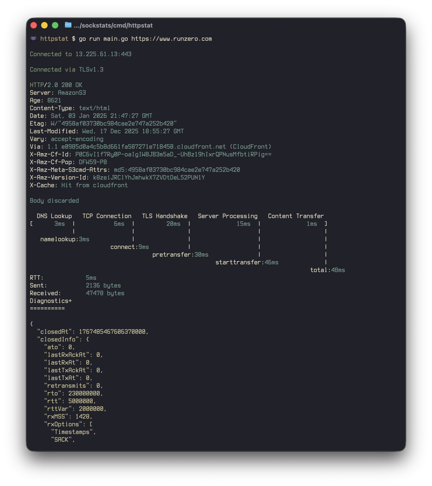

# httpstat

This is a light update to Dave Cheney's [httpstat](https://github.com/davecheney/httpstat) utility, which was inspired by https://github.com/reorx/httpstat.

This version uses [conniver](https://github.com/runZeroInc/conniver) to collect socket statistics from the operating system. 




## Installation
`httpstat` requires Go 1.25 or later.
```
go install github.com/runZeroInc/conniver/cmd/httpstat@latest
```

## Usage
```
httpstat https://example.com/
```
## Features

- Windows/BSD/Linux supported.
- HTTP and HTTPS are supported, for self signed certificates use `-k`.
- Skip timing the body of a response with `-I`.
- Follow 30x redirects with `-L`.
- Change HTTP method with `-X METHOD`.
- Provide a `PUT` or `POST` request body with `-d string`. To supply the `PUT` or `POST` body as a file, use `-d @filename`.
- Add extra request headers with `-H 'Name: value'`.
- The response body is usually discarded, you can use `-o filename` to save it to a file, or `-O` to save it to the file name suggested by the server.
- HTTP/HTTPS proxies supported via the usual `HTTP_PROXY`/`HTTPS_PROXY` env vars (as well as lower case variants).
- Supply your own client side certificate with `-E cert.pem`.